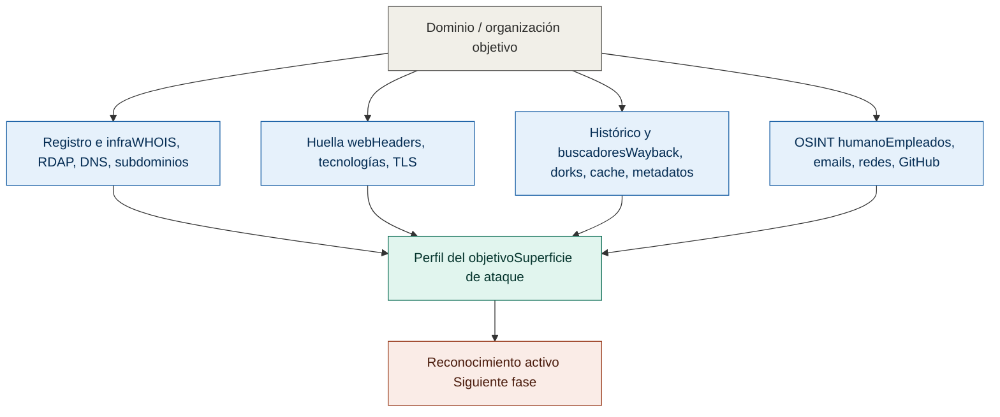
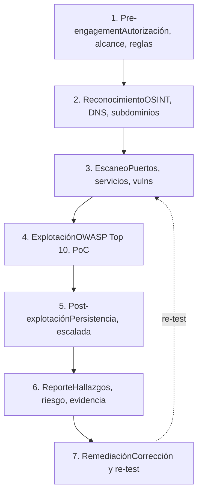

## Introducción

El reconocimiento pasivo es la primera fase de una evaluación de seguridad. Se recopila información sin interactuar directamente con los sistemas objetivo, evitando detección y registro.


## DIAGRAMA DE RECONOCIMIENTO



## Herramientas principales

| Herramienta | Uso | Instalación |
|-------------|-----|-------------|
| `whois`     | Información de registro de dominios | `apt-get install whois` |
| `wafw00f`   | Detección de WAF | `pip install wafw00f` |
| `host`      | Resolución DNS básica | `apt-get install bind-utils` |
| `nslookup`  | Consultas DNS avanzadas | `apt-get install bind-utils` |
| `dig`       | Herramienta DNS potente | `apt-get install dnsutils` |
| `curl`      | Inspección de headers HTTP | `apt-get install curl` |
| `theHarvester` | OSINT de dominios y emails | `pip install theharvester` |
| `whois.cymru.com` | IP reputation | Online |
| `VirusTotal` | Análisis de malware y phishing | Online |
| `Shodan` | Motor de búsqueda IoT/servidores | Online |
| `search.censys.io` | Motor de búsqueda IoT/servidores | Online |
| `dnsdumpster.com` | Motor de búsqueda de Dominios | Online |


## Comandos comunes

### WHOIS - Información de Registros

```bash
# Información básica del dominio
whois ejemplo.com

# Buscar cambios de registrador
whois -c CO ejemplo.co

# Obtener información del registrador
whois -B ejemplo.com
```

### DNS - Resolución y Enumeración

```bash
# Resolución básica
host ejemplo.com
nslookup ejemplo.com
dig ejemplo.com

# Transferencia de zona (si lo permite)
dig @ns1.ejemplo.com ejemplo.com axfr

# Registros específicos
dig ejemplo.com MX      # Servidores de correo
dig ejemplo.com NS      # Servidores DNS
dig ejemplo.com TXT     # Registros de texto (SPF, DMARC)
dig ejemplo.com A       # Registros IPv4
dig ejemplo.com AAAA    # Registros IPv6
dig ejemplo.com CNAME   # Aliases

# Búsqueda inversa (Reverse DNS)
host 8.8.8.8
dig -x 8.8.8.8
```

### Detección de WAF

```bash
wafw00f https://ejemplo.com -a              # prueba todas las firmas, no para en la primera coincidencia
wafw00f -i lista_urls.txt                   # modo lote desde archivo
wafw00f https://ejemplo.com -o salida.json -f json   # exportar para el reporte
wafw00f -l                                  # listar todos los WAF que sabe detectar
wafw00f https://ejemplo.com -p proxy.txt    # a través de proxy (útil con Burp)
```
> ⚠️ **IMPORTANTE**: wafw00f muchas veces da falsos positivos se recomienda utilizar otras alternativas.

```bash
nmap -p 80,443 --script http-waf-detect,http-waf-fingerprint ejemplo.com                                      # scripts NSE de nmap
identYwaf https://ejemplo.com                                                                                 # detección por anomalías en respuestas
curl -sI https://ejemplo.com | grep -iE "server|x-powered|x-cdn|x-sucuri|x-akamai|cf-ray|x-amz|set-cookie"    # Verificar respuesta por curl
```

| Indicio | WAF/CDN probable |
|---------|------------------|
| `cf-ray`, `Server: cloudflare` | Cloudflare |
| `x-sucuri-id`, `x-sucuri-cache` | Sucuri |
| `Server: AkamaiGHost`, `x-akamai-*` | Akamai |
| Cookie `incap_ses_`, `visid_incap_` | Imperva Incapsula |
| `x-amzn-*`, `x-amz-cf-id` | AWS WAF / CloudFront |
| Página "Request Rejected" + ID de soporte | F5 BIG-IP ASM |

### Inspección HTTP Headers

```bash
# Obtener headers del servidor
curl -I https://ejemplo.com

# Headers detallados con información de cookie/seguimiento
curl -v https://ejemplo.com

# Simular navegador específico
curl -A "Mozilla/5.0" -I https://ejemplo.com

# Extraer información del servidor
curl -I https://ejemplo.com | grep -i "server\|powered-by\|x-"
```

### Búsqueda de Subdominios

```bash
# Usando DNS bruto
host -t ns ejemplo.com

# Con theHarvester
theharvester -d ejemplo.com -b all

# Búsqueda en Google (si no está bloqueado)
# site:ejemplo.com

# Certificados SSL/TLS
# Visita: https://crt.sh/?q=ejemplo.com
```

## Técnicas OSINT

### 1. **Enumeración de Subdominios**
```bash
# Online: crt.sh, Certificate Transparency Logs
# Herramientas: subfinder, assetfinder, amass

# Búsqueda pasiva con DNS public
nslookup -type=ANY ejemplo.com 8.8.8.8
```

### 2. **Búsqueda de Información en Motores de Búsqueda**
- Google Dorking: `site:ejemplo.com`, `inurl:admin`, `filetype:pdf`
- Bing: Similar a Google
- Shodan: Búsquedas especializadas en IoT y servidores

### 3. **Análisis de Redes Sociales**
- LinkedIn (empleados, estructura organizacional)
- Twitter/X (información técnica, anuncios)
- GitHub (código fuente expuesto, credenciales)

### 4. **Herramientas Online Útiles**
- **crt.sh** - Certificate Transparency
- **VirusTotal** - Análisis de dominios/IPs
- **Who.is** - Información WHOIS
- **Shodan.io** - Motor de búsqueda especializado
- **Have I Been Pwned** - Verificar brechas
- **Wayback Machine** - Historial del sitio

### 5. **Análisis de Tecnología (Stack)**
```bash
# Usar herramientas online como:
# - BuiltWith.com
# - Wappalyzer (extensión de navegador)
# - Shodan.io

# Headers HTTP revelan tecnología
curl -I https://ejemplo.com | grep -i "x-powered-by\|server"
```

## Recopilación de Información Útil

### Datos que buscar:

1. **Infraestructura**
   - Servidores DNS
   - Servidores de correo (MX records)
   - Rango de IPs
   - Proveedores de hosting

2. **Personas Clave**
   - Administradores
   - Desarrolladores
   - Contactos técnicos

3. **Tecnología Usada**
   - Lenguajes de programación
   - Frameworks
   - CMS
   - Servidores web

4. **Historial**
   - Cambios de DNS
   - Cambios de registrador
   - Versiones antiguas (Wayback Machine)

## Notas y Tips

> ⚠️ **IMPORTANTE**: Solo realiza reconocimiento pasivo en sistemas para los cuales tienes autorización explícita.

### Tips Prácticos:

- **Wayback Machine** (`archive.org`): Descubre rutas históricas, parámetros antiguos, tecnología previa
- **crt.sh**: Enumera subdominios a través de certificados SSL
- **Certificate Transparency Logs**: Los certificados SSL se registran públicamente; útil para descubrimiento
- **DNS Pasivo**: Usa registros públicos sin enviar queries activas al objetivo
- **Redes Sociales**: Las organizaciones a menudo revelan información técnica inadvertidamente
- **Combinación de herramientas**: Usa múltiples fuentes para validar información

### Red Flags (Signos de alerta):

- Headers innecesarios (servidor, versiones expuestas)
- Información de tecnología en comentarios HTML
- Emails expuestos públicamente
- Repositorios de código público con credenciales

## Flujo típico de Recon Pasivo

```
1. WHOIS lookup → Registrador, contactos
   ↓
2. DNS enumeration → Servidores, subdominios
   ↓
3. Inspección HTTP → Headers, cookies, tecnología
   ↓
4. Búsqueda online → Certificados, OSINT
   ↓
5. Wayback Machine → Historial, cambios
   ↓
6. Redes sociales → Información de empleados
   ↓
7. Compilar información → Crear perfil del objetivo
```

## Flujo completo de la metodología



## Referencias

- [OWASP Testing Guide](https://owasp.org/www-project-web-security-testing-guide/)
- [Hacktricks OSINT](https://book.hacktricks.xyz/)
- [CRT.sh](https://crt.sh/)
- [Shodan.io](https://www.shodan.io/)
- [Archive.org Wayback Machine](https://archive.org/)
