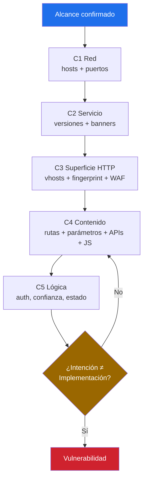
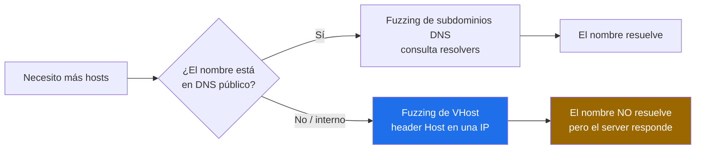
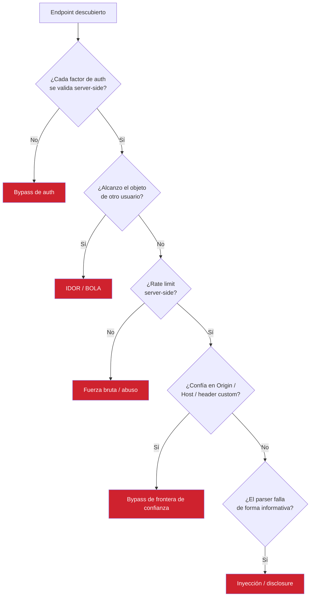

> El reconocimiento activo es donde dejas de *leer sobre* el objetivo y empiezas a *tocarlo*. Cada paquete es una pregunta; cada respuesta es información. El amateur dispara herramientas y lee la salida. El operador formula una hipótesis, envía la sonda mínima para confirmarla o descartarla, y deja que cada respuesta elija el siguiente movimiento. Esta página es un modelo de pensamiento con los comandos adjuntos — no un volcado de comandos con un poco de pensamiento encima.
{: .prompt-info }

## El Modelo Mental: Estás Mapeando una Superficie de Ataque

Estás construyendo un **grafo de funcionalidad alcanzable**. Cada host, puerto, vhost, ruta, parámetro y relación de confianza es un nodo. El recon es la expansión disciplinada de ese grafo hasta encontrar un nodo donde el *comportamiento esperado* y el *comportamiento real* divergen. Esa brecha es el bug.

Tres preguntas guían todo:

1. **¿Qué existe?** — hosts, servicios, vhosts, rutas, parámetros, APIs
2. **¿En qué confía?** — headers, tokens, orígenes, supuestos de interno-vs-externo
3. **¿Dónde la intención ≠ implementación?** — aquí vive la vulnerabilidad



> **ANALIZAR SI SE PUDO OBTENER EL MAXIMO DE INFORMACION DEL HOST A ATACAR**, Analizar correctamente el grafico.
{: .prompt-danger }

---

## Capa 1 — Red: Qué Es Alcanzable

Responde *qué puertas existen físicamente* con el menor ruido que aún te dé verdad de campo. Un único escaneo agresivo es ruidoso y miente — los puertos filtrados se leen como cerrados bajo carga. Hazlo por etapas.

```bash
export T="10.10.10.10"
mkdir -p scans

# Etapa 1 — barrido rápido de todos los puertos
nmap -p- --min-rate 2000 -T4 -Pn -n -oA scans/01_allports $T

# Etapa 2 — extraer los puertos abiertos
PORTS=$(grep -oP '\d+/open' scans/01_allports.gnmap | cut -d/ -f1 | paste -sd,)

# Etapa 3 — enumeración profunda solo sobre puertos abiertos
nmap -p$PORTS -sCV -O --version-all -oA scans/02_deep $T
```

| Flag | Razón del operador |
|------|--------------------|
| `-p-` | Los hallazgos reales viven en puertos raros (8080, 8443, **8505**). El top-1000 los pierde. |
| `--min-rate` | Controla *tu* ritmo. Bájalo en objetivos frágiles o en producción. |
| `-Pn` | Salta el descubrimiento por ICMP — muchos hosts dropean ping y los marcarías muertos. |
| `-n` | Sin DNS inverso = más rápido, menos entradas de log apuntándote. |
| `-sCV` | Scripts por defecto + detección de versión — tu primer *contenido* real. |
| `-oA` | Guarda todos los formatos. El `.gnmap` alimenta la siguiente herramienta; nunca re-escanees para recuperar datos. |

> `masscan` para amplitud, `nmap` para profundidad. Barre un CIDR con `masscan` para encontrar puertos vivos rápido, luego mete esos en un `nmap -sCV` dirigido. Cada herramienta hace lo que mejor sabe.
{: .prompt-tip }

---

## Capa 2 — Servicio: Qué Versión, Qué Stack

Las versiones convierten "existe un servidor web" en "Apache 2.4.50 con un CVE de traversal conocido". Toda tu fase de validación depende de esa cadena.

```bash
nmap -sV --version-intensity 9 -p$PORTS $T
nc -nv $T 80                                  # banner crudo, casi invisible en logs
curl -sI "http://$T" | grep -iE 'server|x-powered-by|via|x-aspnet'
nikto -h "http://$T" -Tuning b                # solo módulo de fingerprint, bajo ruido
```

**Hábito:** en cuanto tengas `Server:`, `X-Powered-By:`, el nombre de un app-server o una versión — anótalo con timestamp. Esa cadena alimenta tus tags de nuclei, la búsqueda de CVE y la elección de wordlist. Un hallazgo de recon que no anotas no existe.

---

## Capa 3 — Superficie HTTP: Hosts, Fingerprint, WAF

Una IP sirve muchos sitios. El DNS muestra los públicos; los interesantes suelen ser **virtual hosts** sin registro DNS — staging, admin, apps internas que el equipo asumió que nadie alcanzaría.



```bash
# Sondear vivos + fingerprint en una sola pasada
cat hosts.txt | httpx -td -title -sc -server -ip -cdn -o live.txt

# Fuzzing de VHost — alto valor, baja huella en DNS
ffuf -w /usr/share/seclists/Discovery/DNS/subdomains-top1million-20000.txt -u "http://$T/" -H "Host: FUZZ.target.internal" -ac -mc all -fs <baseline>

# gobuster vhost — lógica de petición distinta, atrapa casos límite
gobuster vhost -u <dominio> -w /usr/share/seclists/Discovery/DNS/subdomains-top1million-5000.txt --append-domain -k -t 30

#dnsenum --enum inlanefreight.com -f /usr/share/seclists/Discovery/DNS/subdomains-top1million-20000.txt -r

gobuster vhost -u <dominio> -w /usr/share/seclists/Discovery/DNS/subdomains-top1million-110000.txt --append-domain

```

> `-fs <baseline>` es todo el juego. Envía una petición con un Host *basura*, anota el tamaño por defecto, fíltralo. Todo lo que *difiera* del default es un vhost real. Sin esto te ahogas en 200s idénticos.
{: .prompt-warning }

### Fingerprint desde tres ángulos + conoce tu WAF

```bash
whatweb -a3 "https://$T"                              # agresivo, rico en versiones
nuclei -u "https://$T" -t http/technologies/ -silent  # versionado, encuentra paneles
wafw00f -v "https://$T"                               # qué WAF enfrentas
```

### Hash de favicon — identifica la app desde un solo archivo

El hash de un favicon suele identificar el framework/producto exacto y revela activos hermanos que comparten el mismo ícono:

```bash
curl -s "https://$T/favicon.ico" | python3 -c \
'import sys,mmh3,codecs; print(mmh3.hash(codecs.encode(sys.stdin.buffer.read(),"base64")))'
# Pivotea ese hash en Shodan: http.favicon.hash:<valor>  (expansión pasiva)
```

---

## Capa 4 — Contenido: Rutas, Parámetros, APIs

Enumera *dentro* de un host confirmado. El crawling sigue lo que existe; el fuzzing adivina lo oculto; la minería de parámetros encuentra inputs que no están enlazados en ningún lado.

### Crawlea primero — es gratis y encuentra links reales + JS

```bash
katana -u "https://$T" -jc -d 3 -silent -o crawl.txt

# Endpoints históricos — rutas que existieron antes y quizá aún responden
gau "$T" 2>/dev/null | sort -u > historical.txt
# (o: waybackurls "$T")
```

> En objetivos React/SPA los bundles de JavaScript **son** el mapa de rutas. Contienen la lista completa de endpoints de API que el frontend llama. Extráelos y léelos antes de fuzzear a ciegas — la app te entrega su propia tabla de rutas.
{: .prompt-tip }

```bash
# Minar rutas de API desde los bundles JS
katana -u "https://$T" -silent -jc | grep '\.js' | httpx -silent | \
  while read js; do curl -s "$js" | grep -oP '"/[a-zA-Z0-9_/.-]+"'; done | sort -u > api_endpoints.txt
```

### Fuzzing de directorios/archivos — dirigido, consciente del WAF

```bash
ffuf -u "https://$T/FUZZ" \
  -w /usr/share/seclists/Discovery/Web-Content/raft-medium-directories.txt \
  -recursion -recursion-depth 2 -t 15 -rate 30 -ac \
  -mc 200,204,301,302,307,401,403 -o ffuf_dirs.json

# Consciente de extensión — ajusta la wordlist al stack que identificaste
ffuf -u "https://$T/FUZZ" -w wordlist.txt -e .jsp,.do,.action,.bak,.old,.zip -ac -fc 404
```

| Filtro | Úsalo cuando |
|--------|--------------|
| `-mc 200,403` | Conserva los 403 — una ruta prohibida *prueba que existe*. La bypasseas después. |
| `-ac` | Auto-calibra contra soft-404 / basura del WAF. Siempre activo contra un WAF. |
| `-fs/-fw/-fc` | Filtra por tamaño/palabras/código cuando el target responde 200 a todo. |
| `-recursion` | Los directorios descubiertos generan nuevo fuzzing — profundidad 2 es sensata. |

> Ajusta la wordlist al stack. Un objetivo Java/WebLogic quiere `.jsp/.do/.action` y rutas de WebLogic (`/console`, `/wls-wsat/`, `/_async/`, `/em`, `/dms/`) — no rutas PHP. Tu fingerprint de la Capa 3 *es* el selector de wordlist.
{: .prompt-info }

### Descubrimiento de parámetros — los inputs que nadie enlaza

Los parámetros GET/POST ocultos son donde se esconden IDOR, inyección y toggles de modo debug. Fuérzalos:

```bash
# arjun — encuentra parámetros que un crawler nunca ve
arjun -u "https://$T/api/endpoint" -m GET,POST -oT params.txt

# x8 — descubrimiento de parámetros ocultos de alto rendimiento
x8 -u "https://$T/api/endpoint" -w /usr/share/seclists/Discovery/Web-Content/burp-parameter-names.txt
```

### Recon de APIs — la superficie de ataque moderna

Casi toda app real está respaldada por una API. Encuentra el contrato y encuentras todas las rutas:

```bash
# Caza endpoints de documentación / esquema de API
for p in swagger swagger.json swagger-ui.html openapi.json api-docs v2/api-docs \
         graphql graphiql .well-known/openapi actuator actuator/mappings; do
  echo -n "$p -> "; curl -s -o /dev/null -w "%{http_code}\n" "https://$T/$p"
done

# Introspección de GraphQL — si está activa, vuelca el esquema completo
curl -s -X POST "https://$T/graphql" -H "Content-Type: application/json" \
  --data '{"query":"{__schema{types{name fields{name}}}}"}' | head
```

> Un Swagger/OpenAPI accesible o una introspección de GraphQL abierta te entrega la superficie *completa* de la API — cada ruta, parámetro y tipo. Este único hallazgo suele reemplazar horas de fuzzing a ciegas. Los endpoints `actuator` de Spring Boot son el mismo regalo del lado Java.
{: .prompt-tip }

---

## El Arsenal de Bypass de 403/401

Una ruta prohibida es una ruta *confirmada*. El servidor admitió que existe y luego te la negó. Esa negación suele ser superficial — una regla del front-end, no autorización real. Atácala sistemáticamente:

```bash
P="admin"   # la ruta prohibida

# 1. Manipulación de path — slash final, punto, encoding, mayúsculas
for x in "/$P" "/$P/" "/$P/." "//$P//" "/./$P/./" "/$P%20" "/$P%09" \
         "/$P?" "/$P#" "/$P.json" "/$P..;/" "/%2e/$P" "/$P%2e" "/ADMIN" "/Admin"; do
  echo -n "$x -> "; curl -s -o /dev/null -w "%{http_code}\n" "https://$T$x"
done

# 2. Inyección de headers — falsifica la confianza de la que el WAF/app depende
for h in "X-Forwarded-For: 127.0.0.1" "X-Forwarded-Host: localhost" \
         "X-Original-URL: /$P" "X-Rewrite-URL: /$P" "X-Custom-IP-Authorization: 127.0.0.1" \
         "X-Originating-IP: 127.0.0.1" "X-Remote-Addr: 127.0.0.1"; do
  echo -n "[$h] -> "; curl -s -o /dev/null -w "%{http_code}\n" -H "$h" "https://$T/$P"
done

# 3. Override de método — GET prohibido, ¿quizá POST/HEAD/PUT/OPTIONS no?
for m in POST PUT HEAD OPTIONS PATCH TRACE; do
  echo -n "$m -> "; curl -s -o /dev/null -w "%{http_code}\n" -X "$m" "https://$T/$P"
done
```

> `nuclei -t http/fuzzing/403-bypass.yaml` automatiza buena parte de esto, pero entiende *por qué* funciona cada uno: la app confía en un header que no debería (`X-Original-URL`), o normaliza el path distinto al proxy de enfrente. Esa brecha de parseo proxy-vs-app es también la raíz del request smuggling — misma clase de fallo, radio de impacto mayor.
{: .prompt-info }

---

## Leyendo las Señales — Interpretación de Respuestas

La diferencia del profesional es la *interpretación*. El mismo código de estado significa cosas distintas según el contexto. Aprende a leer las pistas:

| Señal | Significado probable | Siguiente movimiento |
|-------|---------------------|----------------------|
| `403` en una ruta | Existe, bloqueada por front-end | Corre el arsenal de bypass |
| `401` | Existe, requiere auth | Busca el mecanismo de auth; credenciales default |
| `200` pero cuerpo diminuto/idéntico | Soft-404 / catch-all | Fija baseline con `-fs`, refiltra |
| `302` a `/login` | Ruta protegida confirmada | Anótala; revísala tras autenticarte |
| `500` con input malformado | El parser rompió — fugando internals | Lee el stack trace; fuzzea más duro |
| `405 Method Not Allowed` | La ruta existe, verbo equivocado | Enumera métodos permitidos (OPTIONS) |
| El *tiempo* de respuesta difiere | Se tomó una rama lógica (usuario existe, query corrió) | Enumeración basada en timing |
| Mismo código, distinto tamaño | El comportamiento divergió | El diff de tamaño/palabras es tu señal real |

> El código de estado es el titular; **tamaño, conteo de palabras y timing son la historia**. Dos `200` que difieren en 12 bytes te están diciendo que la aplicación tomó un camino de código distinto. Esa divergencia es donde excavas.
{: .prompt-warning }

---

## Capa 5 — Lógica y Confianza: Donde Realmente Viven los Bugs

Los escáneres encuentran CVEs *conocidos*. Los hallazgos que importan en apps a medida son fallos de lógica que ningún template conoce. Para cada endpoint, interroga sus supuestos de confianza:



- **Logins multifactor** (ej. password + pin) — ¿el servidor valida *ambos*? Envía un password correcto con un pin equivocado y observa. Un factor que solo se chequea en el cliente es decorativo.
- **IDOR/BOLA** — ¿IDs secuenciales o adivinables en rutas/parámetros? Cambia un número, alcanza el objeto de otro usuario.
- **Rate limiting** — ¿se aplica server-side o solo en el JS del cliente? Repite la petición en bucle; los límites solo de cliente no son límites.
- **Enumeración de usuarios** — ¿"usuario malo" difiere de "password mala" en cuerpo, código *o timing*? Cualquier diferencia filtra cuentas válidas.
- **Confianza en Origin/Host** — ¿cambiar `Origin`, `Referer` o un campo de origen propio de la app cambia la autorización?
- **Manejo de input** — caracteres especiales, payloads gigantes, tipos JSON equivocados (`{}` donde se espera un string). Cómo *falla* el parser revela los internals.

### Validación con nuclei — escala, luego verifica a mano

```bash
nuclei -update-templates
nuclei -u "https://$T" -tags <stack>,cve -severity medium,high,critical -stats -o nuclei.txt
nuclei -u "https://$T" -t http/misconfiguration/ -t http/exposures/ -stats -o nuclei_exp.txt
```

> Un match de nuclei es una *pista*, no un hallazgo. Reproduce cada hit a mano antes de que vaya a un reporte. Un PoC no destructivo que pruebe presencia (versión, endpoint alcanzable, firma de respuesta) es lo que el triage espera. Nunca dispares automáticamente un exploit destructivo (deserialización, clase DoS) contra un servicio en vivo — puedes tumbarlo, y eso termina el engagement.
{: .prompt-danger }

---

## Evasión de WAF — Cuando el Firewall Responde

Identificaste el WAF en la Capa 3. Cuando empiece a devolver 403/406/429, adáptate en vez de martillar:

- **Baja el ritmo primero.** `-t 10 -rate 20` en ffuf. La mayoría de "bloqueos de WAF" son en realidad throttling por rate. Ir más lento restaura la señal.
- **Variación de encoding.** URL-encode, doble-encode, mayúsculas mixtas, normalización unicode. `/admin` → `/%61dmin` → `/ADMIN`.
- **Posicionamiento del payload.** Algunos WAF solo inspeccionan el path, no headers ni cuerpo — mueve la prueba a donde no está mirando.
- **Descubrimiento del origen.** Si el WAF es un CDN (Cloudflare/Akamai), el verdadero premio es encontrar la **IP de origen** (DNS histórico, SANs del certificado SSL, subdominios mal configurados) y golpearla directo — bypasseando el WAF por completo.

```bash
# Confirma a qué te enfrentas antes de evadir
wafw00f "https://$T"
# Fuzzing con ritmo controlado bajo un WAF
ffuf -u "https://$T/FUZZ" -w list.txt -t 10 -rate 20 -ac -mc 200,301,401,403
```

---

## OPSEC — ¿Qué Tan Ruidoso Eres?

| Acción | Riesgo de detección | Alternativa más silenciosa |
|--------|---------------------|----------------------------|
| `masscan` de todos los puertos | Alto | `nmap` por etapas, `--min-rate` bajo |
| Escaneo de vulns amplio | Alto | Templates dirigidos por fingerprint |
| Banner grab / `curl -I` | Bajo | ya es silencioso |
| Fingerprint de SO `-O` | Bajo–Medio | p0f pasivo desde tráfico capturado |
| `ffuf` agresivo | Alto | Reduce `-rate`, crawlea primero |
| Spray de bypass 403 | Medio–Alto | Prueba los 2–3 bypasses más probables, no los 30 |

**El control del ritmo le gana a las herramientas de sigilo.** Un escaneo paciente, con rate limitado y dirigido por fingerprint genera una fracción de las peticiones de una fuerza bruta a ciegas — y encuentra *más* porque está apuntado. Ruidoso y tonto pierde contra silencioso y dirigido, siempre.

---

## El Pipeline Completo — Encadenado

```bash
#!/usr/bin/env bash
# Pipeline de recon — ejecuta SOLO contra objetivos autorizados
export T="$1"; mkdir -p "recon_$T" && cd "recon_$T"

# C1-C2: red + servicio
nmap -p- --min-rate 2000 -Pn -n -oA allports "$T"
PORTS=$(grep -oP '\d+/open' allports.gnmap | cut -d/ -f1 | paste -sd,)
nmap -p"$PORTS" -sCV -oA deep "$T"

# C3: superficie HTTP + fingerprint + WAF
echo "$T" | httpx -td -title -sc -server -ip -o live.txt
wafw00f "https://$T" | tee waf.txt

# C4: crawl + histórico + endpoints JS + fuzz de dirs + params + API
katana -u "https://$T" -jc -d 3 -silent -o crawl.txt
gau "$T" 2>/dev/null | sort -u > historical.txt
ffuf -u "https://$T/FUZZ" -w raft-medium-directories.txt -recursion -t 15 -rate 30 -ac \
  -mc 200,301,401,403 -o dirs.json
for p in swagger.json openapi.json api-docs graphql actuator/mappings; do
  echo -n "$p -> "; curl -s -o /dev/null -w "%{http_code}\n" "https://$T/$p"
done | tee api_probe.txt

# C5: validación
nuclei -u "https://$T" -tags cve -severity high,critical -stats -o nuclei.txt
echo "[+] Recon montado en recon_$T/ — ahora lee, piensa y sondea a mano."
```

---

## Errores Comunes

1. **Confiar en un escaneo que terminó demasiado rápido.** Milisegundos + cero resultados casi siempre significa que nunca llegaste al objetivo. `curl` para confirmar conectividad antes de creerte un negativo.
2. **Saltarte `-p-`.** Todo el engagement era un WebLogic en `:8505` que el top-1000 jamás tocó.
3. **Wordlist equivocada para el stack.** Listas PHP contra una app Java no encuentran nada — y concluyes mal que "no hay rutas ocultas".
4. **Filtrar los 403.** Prohibido ≠ inexistente. Es una ruta confirmada esperando un bypass.
5. **Ignorar los bundles JS.** Las SPA envían el mapa de rutas de la API en su JavaScript. Léelo antes de fuzzear a ciegas.
6. **Saltarte el descubrimiento de parámetros.** El input vulnerable muchas veces no está enlazado en ningún lado — solo `arjun`/`x8` lo encuentran.
7. **Sin timestamps / sin notas.** Si no puedes mostrar la cadena de descubrimiento, el triage no puede confiar en el hallazgo.

> **El hilo conductor:** el recon se guía por hipótesis, no por herramientas. Formula una pregunta, envía la sonda mínima para responderla, anota la respuesta, deja que elija la siguiente pregunta. Las herramientas son cómo preguntas. El entendimiento es lo que te consigue el bug.
{: .prompt-info }
