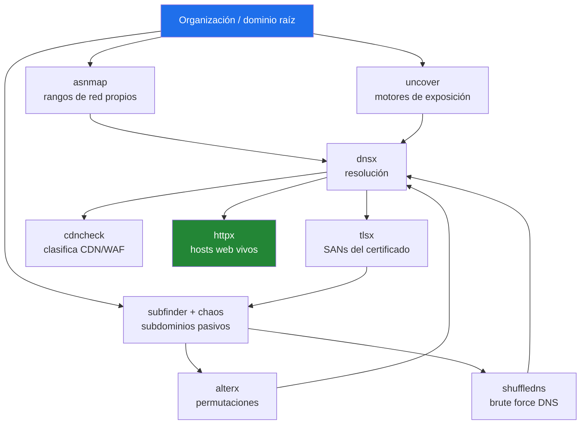

> El ecosistema de ProjectDiscovery está diseñado para encadenarse: la salida de una herramienta alimenta a la siguiente por stdin/stdout. Dominar el descubrimiento de dominios no es memorizar flags sueltos — es entender el pipeline: de la organización a sus rangos, de los rangos a los subdominios, de los subdominios a los hosts vivos. Esta página es ese pipeline.
{: .prompt-info }

## El Pipeline Mental



Fíjate en el bucle: `tlsx` saca dominios nuevos de los certificados y los reinyecta a la enumeración. El recon de subdominios es iterativo, no lineal.

> Todo lo **pasivo** (subfinder, chaos, uncover, asnmap, tlsx sobre datos públicos) no toca al objetivo. Lo **activo** (dnsx resolviendo, shuffledns con brute force, httpx, naabu) sí genera tráfico. Mantén clara la frontera y respeta tu alcance autorizado.
{: .prompt-danger }

---

## 0. Setup — Las API Keys (esto separa al amateur del pro)

El recon pasivo *de verdad* depende de fuentes de terceros. Sin keys, subfinder y uncover rinden una fracción.

```bash
# Genera el archivo de config la primera vez
subfinder -d example.com -all -silent

# Edita las keys
nano ~/.config/subfinder/provider-config.yaml
nano ~/.config/uncover/provider-config.yaml

# Verifica qué fuentes están activas
subfinder -ls
```

Las keys gratuitas que más rinden, por prioridad: **Chaos** (dataset propio de PD, en cloud.projectdiscovery.io), **VirusTotal**, **SecurityTrails**, **GitHub** (un PAT sin scopes), **Censys** y **Shodan** (esta última para uncover).

Sintaxis en el YAML (cuidado con la indentación):

```yaml
chaos: ["tu_key"]
virustotal: ["tu_key"]
securitytrails: ["tu_key"]
github: ["ghp_tutoken"]
censys: ["API_ID:API_SECRET"]
```

---

## 1. asnmap — De la Organización a sus Rangos

Antes de subdominios, entiende qué *posee* la organización. Convierte un nombre o IP en sus rangos CIDR. 100% pasivo.

```bash
# De dominio o IP a su ASN y rangos
echo "example.com" | asnmap -silent

# De nombre de organización a CIDRs
asnmap -org "ACME Corp" -silent

# Por número de ASN directo
asnmap -asn AS14421 -silent

# Por IP
asnmap -ip 1.2.3.4 -silent
```

| Flag | Descripción |
|------|-------------|
| `-d` | Dominio objetivo |
| `-org` | Nombre de organización (según WHOIS de los rangos) |
| `-asn` | Número de ASN |
| `-ip` | IP individual |
| `-silent` | Solo resultados, sin banner |

> Esto revela infraestructura propia que el scope obvio a veces no menciona. Los CIDR que devuelve los puedes pivotear después en uncover (`cidr:...`) o escanear con naabu.
{: .prompt-tip }

---

## 2. subfinder — Enumeración Pasiva de Subdominios

El caballo de batalla. Consulta decenas de fuentes pasivas sin tocar al objetivo.

```bash
# Enumeración con TODAS las fuentes
subfinder -d example.com -all -silent -o subs.txt

# Múltiples dominios desde archivo
subfinder -dL dominios.txt -all -silent -o subs.txt

# Con resolución inmediata (muestra solo los que resuelven)
subfinder -d example.com -all -nW -silent

# Recursivo (solo fuentes que soportan recursión)
subfinder -d example.com -recursive -silent

# Ver de qué fuente vino cada subdominio
subfinder -d example.com -all -cs -silent
```

| Flag | Descripción |
|------|-------------|
| `-d` / `-dL` | Dominio único / lista de dominios |
| `-all` | Activa todas las fuentes (incluidas las lentas). Para bug bounty serio, siempre. |
| `-recursive` | Enumeración recursiva |
| `-nW` | Solo subdominios que resuelven |
| `-cs` | Muestra la fuente de cada resultado |
| `-o` | Archivo de salida |
| `-silent` | Solo subdominios, ideal para pipes |

---

## 3. chaos — El Dataset Propio de ProjectDiscovery

Base de datos de subdominios mantenida por PD. Key gratuita.

```bash
# Subdominios de un dominio
chaos -d example.com -silent -o chaos_subs.txt

# Listar dominios de programas de bug bounty disponibles en chaos
chaos -dL
```

---

## 4. uncover — Cruzar con Motores de Exposición

Consulta Shodan, Censys, Fofa, Quake, Hunter y ZoomEye con una sola sintaxis, sin tocar el objetivo.

```bash
# Por organización en varios motores
uncover -q 'org:"ACME Corp"' -e shodan,censys,fofa -silent

# Por certificado SSL — muy potente para activos ocultos
uncover -q 'ssl:"example.com"' -silent

# Por rango CIDR (encadena con asnmap)
uncover -q 'cidr:1.2.3.0/24' -silent

# Por favicon hash, título, etc.
uncover -q 'title:"Login Panel"' -e shodan -silent
```

| Flag | Descripción |
|------|-------------|
| `-q` | Query (sintaxis del motor) |
| `-e` | Motores: shodan, censys, fofa, quake, hunter, zoomeye, netlas |
| `-f` | Formato de salida (ip, host, port, url) |
| `-silent` | Solo resultados |

---

## 5. alterx — Permutaciones Inteligentes

Genera variantes (`dev-`, `staging`, `api2`...) para descubrir lo que las fuentes pasivas no listan.

```bash
# Permutaciones desde una lista de subdominios
cat subs.txt | alterx -silent -o permutados.txt

# Con patrones personalizados
cat subs.txt | alterx -p '{{word}}-{{sub}}.{{root}}' -silent

# Enriquecido: extrae palabras de los subdominios encontrados
cat subs.txt | alterx -enrich -silent
```

> alterx genera *candidatos*, no subdominios confirmados. Su salida SIEMPRE pasa por dnsx o shuffledns para filtrar los que realmente resuelven. Si no, tendrás miles de nombres inventados.
{: .prompt-warning }

---

## 6. shuffledns — Brute Force de Subdominios

Resolución masiva y brute-force apoyado en massdns. Esto ya es **activo**.

```bash
# Brute force con wordlist
shuffledns -d example.com \
  -w /usr/share/seclists/Discovery/DNS/subdomains-top1million-110000.txt \
  -r resolvers.txt -mode bruteforce -silent -o brute_subs.txt

# Modo resolución: filtra una lista existente, dejando solo los que resuelven
cat all_subs.txt | shuffledns -d example.com -r resolvers.txt -mode resolve -silent
```

| Flag | Descripción |
|------|-------------|
| `-w` | Wordlist de subdominios |
| `-r` | Lista de resolvers DNS (consíguela actualizada) |
| `-mode bruteforce` | Brute force con wordlist |
| `-mode resolve` | Solo resolver una lista dada |

> Necesita una buena lista de **resolvers** públicos y rápidos. Una lista de resolvers obsoleta da falsos negativos. Genérala fresca o usa proyectos como `dnsvalidator`.
{: .prompt-tip }

---

## 7. dnsx — Resolución y Toolkit DNS

Resuelve, filtra y extrae registros DNS a alta velocidad. El pegamento del pipeline.

```bash
# Filtrar solo subdominios vivos (que resuelven)
cat all_subs.txt | dnsx -silent -o resueltos.txt

# Resolver y mostrar la IP
cat all_subs.txt | dnsx -silent -a -resp-only

# Traer varios registros
cat all_subs.txt | dnsx -silent -a -aaaa -cname -mx -resp

# Brute force de subdominios con dnsx
dnsx -d example.com -w wordlist.txt -silent

# PTR inverso desde una lista de IPs (encadena con asnmap)
echo "1.2.3.0/24" | dnsx -ptr -resp-only -silent
```

| Flag | Descripción |
|------|-------------|
| `-a` `-aaaa` `-cname` `-mx` `-ns` `-txt` `-ptr` | Tipos de registro |
| `-resp` / `-resp-only` | Muestra la respuesta / solo la respuesta |
| `-w` | Wordlist (modo brute force) |
| `-silent` | Solo resultados |

---

## 8. tlsx — Inteligencia de Certificados

Los certificados SSL filtran dominios en sus campos SAN y CN. Esto reinyecta nuevos dominios al pipeline.

```bash
# Extraer SAN y CN de los certificados (descubre dominios hermanos)
cat resueltos.txt | tlsx -san -cn -silent -resp-only

# Solo los nombres del certificado, listos para reinyectar
cat ips.txt | tlsx -san -cn -silent -resp-only | sort -u >> nuevos_dominios.txt

# Información completa del TLS
echo "example.com" | tlsx -silent -json
```

> El campo SAN de un certificado suele listar todos los dominios que cubre — incluyendo activos que no aparecían en la enumeración pasiva. Saca los nombres, fíltralos por tu dominio raíz, y vuélvelos a meter a subfinder/dnsx. Ese bucle es donde aparecen los assets escondidos.
{: .prompt-tip }

---

## 9. cdncheck — Clasificar CDN / WAF / Cloud

Distingue qué está detrás de un CDN/WAF (donde el escaneo directo es inútil) de la infraestructura de origen real. Offline y rápido.

```bash
# Clasificar una lista de IPs/hosts
cat resueltos.txt | dnsx -resp-only -silent | cdncheck -silent -resp

# Excluir CDN para quedarte solo con origen escaneable
cat ips.txt | cdncheck -silent -resp | grep -v cdn
```

---

## 10. httpx — Hosts Web Vivos + Fingerprint

Cierra el pipeline: de subdominios resueltos a servidores web vivos con metadatos. Esto es **activo**.

```bash
# Probing completo: estado, título, tecnología, servidor
cat all_subs.txt | httpx -silent -title -tech-detect -status-code -o vivos.txt

# Con IP, CDN y longitud de respuesta
cat all_subs.txt | httpx -silent -ip -cdn -cl -sc

# Filtrar por código de estado
cat all_subs.txt | httpx -silent -mc 200,403

# Capturar screenshots de cada host vivo
cat all_subs.txt | httpx -silent -screenshot
```

| Flag | Descripción |
|------|-------------|
| `-title` | Título de la página |
| `-td` / `-tech-detect` | Detección de tecnología (Wappalyzer) |
| `-sc` / `-status-code` | Código de estado |
| `-ip` `-cdn` `-cl` | IP, detección de CDN, content-length |
| `-mc` / `-fc` | Filtrar por / excluir códigos |
| `-screenshot` | Captura de pantalla |

---

## El Pipeline Completo — Encadenado

```bash
#!/usr/bin/env bash
# Descubrimiento de dominios con ProjectDiscovery
# Ejecutar SOLO contra objetivos autorizados
export TARGET="$1"
mkdir -p "recon_$TARGET" && cd "recon_$TARGET"

# 1. Rangos propios de la organización (pasivo)
echo "$TARGET" | asnmap -silent | tee asn_ranges.txt

# 2. Subdominios pasivos (pasivo)
subfinder -d "$TARGET" -all -silent -o subs_passive.txt
chaos -d "$TARGET" -silent -o subs_chaos.txt 2>/dev/null

# 3. Motores de exposición (pasivo)
uncover -q "ssl:\"$TARGET\"" -silent -o uncover_ssl.txt 2>/dev/null

# 4. Permutaciones (genera candidatos)
cat subs_passive.txt | alterx -silent -o subs_permuted.txt

# 5. Consolidar todo
cat subs_*.txt uncover_*.txt 2>/dev/null | sort -u > all_subs.txt
echo "[+] Candidatos totales: $(wc -l < all_subs.txt)"

# --- A PARTIR DE AQUÍ ES ACTIVO ---

# 6. Resolver: dejar solo los que existen
cat all_subs.txt | dnsx -silent -a -resp-only | sort -u > resueltos.txt

# 7. Sacar dominios nuevos de los certificados y reinyectar
cat resueltos.txt | tlsx -san -cn -silent -resp-only | \
  grep "$TARGET" | sort -u >> all_subs.txt

# 8. Clasificar CDN vs origen
cat resueltos.txt | cdncheck -silent -resp | tee cdn_clasificado.txt

# 9. Hosts web vivos + fingerprint
cat all_subs.txt | sort -u | \
  httpx -silent -title -tech-detect -status-code -ip -o vivos.txt

echo "[+] Inventario en recon_$TARGET/vivos.txt"
```

```bash
# Uso:
chmod +x recon.sh && ./recon.sh example.com
```

---

## Versión de Una Línea (cuando ya dominas las piezas)

```bash
# Pasivo → resolución → motores de exposición
subfinder -d example.com -all -silent | \
  dnsx -silent -a -resp-only | \
  uncover -q 'cidr:{ip}' -silent

# Subdominios → vivos → tecnología, todo de corrido
subfinder -d example.com -all -silent | \
  httpx -silent -title -tech-detect -sc
```

---

## Tabla de Referencia Rápida

| Herramienta | Rol en el pipeline | ¿Toca al objetivo? |
|-------------|--------------------|--------------------|
| `asnmap` | Organización → rangos CIDR | No (pasivo) |
| `subfinder` | Subdominios pasivos | No (pasivo) |
| `chaos` | Dataset de subdominios de PD | No (pasivo) |
| `uncover` | Motores de exposición (Shodan, etc.) | No (pasivo) |
| `alterx` | Permutaciones / candidatos | No (genera texto) |
| `tlsx` | Dominios desde certificados | Pasivo si usa datos públicos |
| `shuffledns` | Brute force DNS (massdns) | **Sí (activo)** |
| `dnsx` | Resolución y registros DNS | **Sí (activo)** |
| `cdncheck` | Clasifica CDN/WAF/cloud | No (offline) |
| `httpx` | Hosts web vivos + fingerprint | **Sí (activo)** |

> **El hilo conductor:** no corras las herramientas en aislamiento. El poder de ProjectDiscovery está en el `|`. asnmap alimenta a uncover, subfinder alimenta a dnsx, dnsx alimenta a tlsx que vuelve a subfinder. Piensa en flujos de datos, no en comandos sueltos.
{: .prompt-info }
